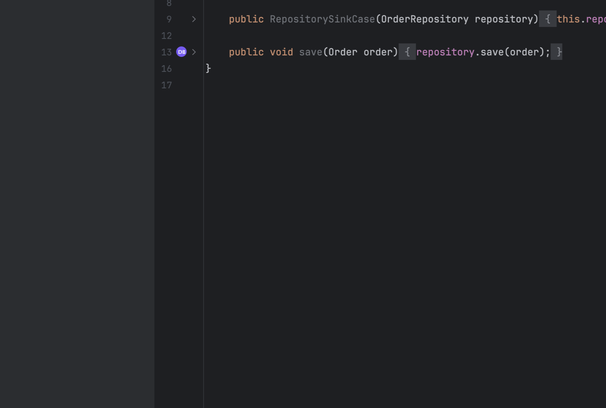

# Lattency

Lattency is an IntelliJ IDEA plugin that marks I/O in Java code.

Milestone 1 detects direct database, HTTP, messaging, file, and generic blocking sinks in
method bodies. It includes zero-configuration rules for common Java and Spring APIs, supports
custom sinks and exclusions through project-root `lattency.yml`, suppresses `@NonBlocking`
methods, and displays a category glyph with a per-call explanation in the method gutter.
Transitive propagation and call-site markers are intentionally deferred.



## Modules

- `core`: IntelliJ-independent I/O taxonomy and coloring model.
- `intellij-adapter`: IntelliJ PSI and presentation integration.

## Run

```shell
./gradlew build
./gradlew :intellij-adapter:runIde --args="$(pwd)/test-fixtures"
```

The fixture project also works as a standalone Gradle build and contains one named Java class
for each supported, suppressed, excluded, and future behavior.
